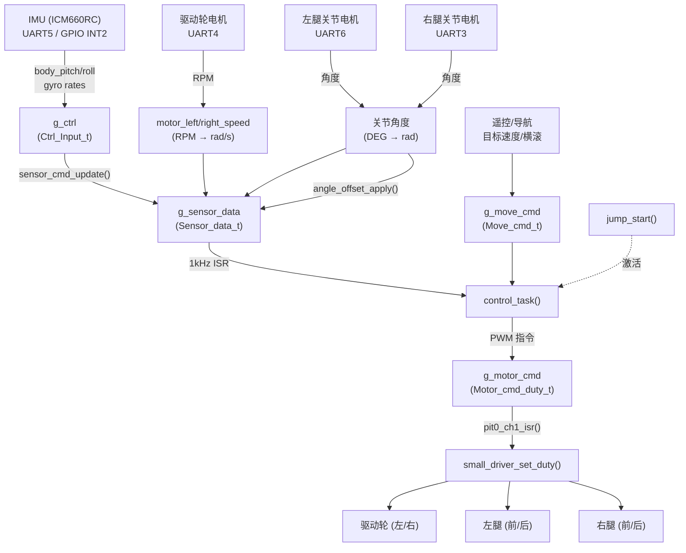
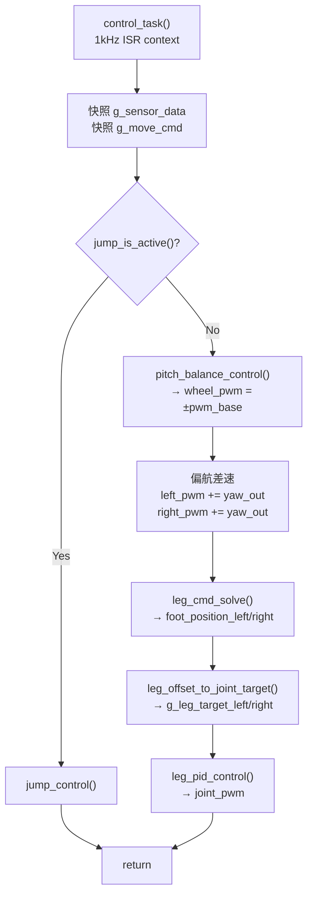
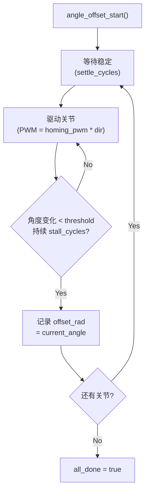
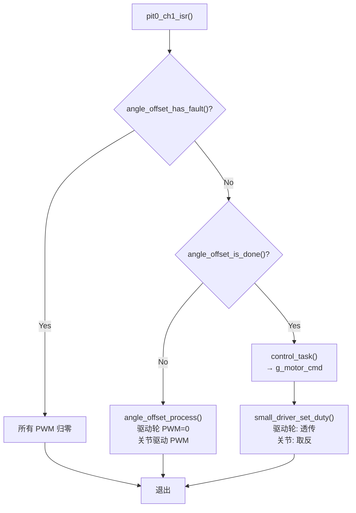

# 平衡车控制系统文档

## 1. 系统架构总览

### 1.1 模块分层

```
┌─────────────────────────────────────────────────────────────┐
│  应用层 (app/robot_control/)                                 │
│  ┌──────────────┐  ┌──────────┐                             │
│  │ robot_control │  │  jump    │  主控任务 / 跳跃状态机       │
│  └──────┬───────┘  └────┬─────┘                             │
├─────────┼───────────────┼────────────────────────────────────┤
│  控制层 (control/)      │                                    │
│  ┌────────┐ ┌──────────┐┌──────────┐┌──────────┐           │
│  │balance │ │   leg    ││   leg    ││  angle   │           │
│  │ pitch  │ │cmd_solve ││pid_control││ offset   │           │
│  │ lqr    │ │          ││vmc_control││          │           │
│  └────┬───┘ └────┬─────┘└────┬─────┘└────┬─────┘           │
├───────┼──────────┼───────────┼───────────┼──────────────────┤
│  数学库 (control/leg/)       │           │                   │
│  ┌──────────┐ ┌──────────┐  │           │                   │
│  │kinematics│ │ jacobian │  │           │                   │
│  └────┬─────┘ └────┬─────┘  │           │                   │
├───────┼─────────────┼────────┼───────────┼──────────────────┤
│  PID 库 (lib/pid/)   │        │           │                   │
│  ┌──────────┐       │        │           │                   │
│  │pid_calc  │◄──────┴────────┴───────────┘                   │
│  └──────────┘                                                │
├─────────────────────────────────────────────────────────────┤
│  驱动层 (app/robot_control/small_driver_uart_control)        │
│  UART3/4/6 数据收发、协议解析                                 │
└─────────────────────────────────────────────────────────────┘
```

### 1.2 数据流图



### 1.3 中断时序

```
pit0_ch0 (1kHz)       pit0_ch1 (1kHz)       UART ISR (异步)
┌──────────────┐      ┌──────────────┐      ┌──────────────┐
│ imu_poll()   │      │ 标定分支:    │      │ UART3: 右腿  │
│ (轮询模式)   │      │  angle_      │      │ UART4: 驱动轮│
│              │      │  offset_     │      │ UART6: 左腿  │
│              │      │  process()   │      │ UART5: IMU   │
│              │      │              │      │              │
│              │      │ 正常运行:    │      │ 数据接收     │
│              │      │  control_    │      │ (异步回传)   │
│              │      │  task()      │      │              │
│              │      │              │      │              │
│              │      │ small_driver │      │              │
│              │      │ _set_duty()  │      │              │
└──────────────┘      └──────────────┘      └──────────────┘
```

---

## 2. 数据类型定义

### 2.1 传感器数据 (`Sensor_data_t`)

定义于 `project/code/app/robot_control/types.h`

| 字段 | 类型 | 单位 | 说明 |
|------|------|------|------|
| `accel_z` | float | m/s² | Z 轴加速度 |
| `gyro_yaw / gyro_pitch / gyro_roll` | float | rad/s | 三轴角速度 |
| `angle_pitch / angle_yaw / angle_roll` | float | rad | IMU 姿态角 |
| `motor_left_speed / motor_right_speed` | float | rad/s | 驱动轮转速 |
| `joint_left_front_angle` … `joint_right_back_angle` | float | rad | 4 个关节角度（已标定） |
| `joint_left_front_speed` … `joint_right_back_speed` | float | rad/s | 4 个关节角速度（差分） |

### 2.2 电机指令 (`Motor_cmd_duty_t`)

| 字段 | 类型 | 范围 | 说明 |
|------|------|------|------|
| `left_motor_pwm / right_motor_pwm` | int | ±10000 | 驱动轮 PWM |
| `left_front_joint_pwm` … `right_back_joint_pwm` | int | ±10000 | 4 个关节电机 PWM |

### 2.3 运动指令 (`Move_cmd_t`)

| 字段 | 类型 | 范围 | 说明 |
|------|------|------|------|
| `target_speed` | float | [-1, +1] | 目标速度 |
| `target_height` | float | [-1, +1] | 目标高度（保留） |
| `target_roll` | float | [-1, +1] | 目标横滚（压弯） |

### 2.4 足端位置 (`Foot_position_t`)

| 字段 | 类型 | 单位 | 说明 |
|------|------|------|------|
| `x` | float | mm | 足端 X 偏移（+前） |
| `y` | float | mm | 足端 Y 偏移（+下） |

### 2.5 五杆机构参数

| 宏 | 值 | 单位 | 说明 |
|----|-----|------|------|
| `LEG_JOINT_DISTANCE` | 48.0 | mm | 髋关节电机间距 |
| `LEG_THIGH` | 85.0 | mm | 大腿长度 |
| `LEG_SHANK` | 135.0 | mm | 小腿长度 |
| `LEG_LENGTH_STANDARD` | 45.0 | mm | 标准腿长 |
| `LEG_WHEEL_RADIUS` | 32.5 | mm | 驱动轮半径 |

### 2.6 物理参数

| 宏 | 值 | 单位 | 说明 |
|----|-----|------|------|
| `ROBOT_BODY_MASS` | 2.5 | kg | 车体质量 |
| `ROBOT_WHEEL_MASS` | 0.1 | kg | 单轮质量 |
| `ROBOT_BODY_INERTIA` | 0.015 | kg·m² | 俯仰惯量 |
| `ROBOT_COM_OFFSET` | 0.025 | m | 髋关节到质心距离 |

---

## 3. 主控制循环 (`robot_control.c`)

### 3.1 全局 PID 实例

| 变量 | 类型 | 角色 | 参数 |
|------|------|------|------|
| `g_pitch_angle_pid` | PID_Controller_t | 俯仰角度环（外环） | kp=25, ki=0, kd=0, out_max=270 |
| `g_pitch_gyro_pid` | PID_Controller_t | 俯仰角速度环（内环） | kp=-1100, ki=0, kd=3, out_max=10000 |
| `g_speed_pid` | PID_Controller_t | 速度环（与前向并联） | kp=-0.4, ki=0, kd=0, out_max=10000 |
| `g_yaw_pid` | PID_Controller_t | 偏航角环 | kp=10, ki=0.1, kd=1, out_max=3000 |
| `g_leg_speed_pid` | PID_Controller_t (static) | 腿速度闭环 | kp=400, ki=0.5, kd=0, out_max=60 |
| `g_leg_roll_pid` | PID_Controller_t (static) | 腿横滚闭环 | kp=-10, ki=0, kd=0, out_max=1 |
| `g_leg_left_pid` / `g_leg_right_pid` | Leg_PID_t (static) | 腿关节角度 PID | kp=1500, ki=0, kd=4, out_max=10000 |

### 3.2 `control_task()` 执行流程



### 3.3 公开接口

#### `void robot_control_init(void)`
初始化所有 PID 控制器、遥控参数绑定、跳跃模块。在 `main()` 中调用一次。

#### `void sensor_update(const Sensor_data_t *sensor)`
更新 `g_sensor_data` 快照。

#### `void command_update(const Move_cmd_t *cmd)`
更新 `g_move_cmd` 快照。

#### `void control_task(void)`
主控制函数，在 `pit0_ch1_isr()` 中以 1kHz 调用。

#### `void sensor_cmd_update(const Ctrl_Input_t *ctrl, Sensor_data_t *sensor, Move_cmd_t *cmd)`
桥接函数：将 IMU/电机原始数据填充到 `Sensor_data_t`，进行角度标定补偿。

#### `void robot_control_reset_balance_pid(void)`
清零俯仰平衡三个 PID 的积分项和微分滤波器。跳跃模块在相位切换时调用。

#### `void leg_offset_to_joint_target(LegSide_t, const Foot_position_t*, Leg_Target_t*)`
将足端笛卡尔偏移量通过雅可比逆解转换为关节目标角度。供 `control_task` 和 `jump.c` 复用。

---

## 4. 俯仰平衡控制 (`pitch_balance.c`)

### 4.1 串级 PID 控制 (`pitch_balance_control`)

```
                     ┌──────────┐
 target_speed = 0 ──→│ speed    │── speed_output ───────────────────┐
 speed_cur ─────────→│ PID      │                                   │
                     └──────────┘                                   │
                     (10Hz 降频, counter%10==0)                     │
                                                                    │
                     ┌──────────┐     ┌──────────┐                  │
 target_angle = 0 ──→│ angle    │────→│ gyro     │── pwm_base ───┬─→ left  = +pwm
 angle_cur ─────────→│ PID      │     │ PID      │              │   right = -pwm
                     └──────────┘     └──────────┘              │
                     (10Hz)           (1kHz, 全速)               │
                                                   + speed_out ─┤
                                                               │
                     ┌──────────────┐                           │
                     │ gravity      │── ff_gravity ─────────────┘
                     │ G*sin(angle) │
                     └──────────────┘
```

**特点：**
- 速度环以 100 Hz（每 10 个周期）降频运行，角度环同步降频
- 角速度环满频 1 kHz 运行
- 重力前馈补偿非线性项 `G * sin(angle)`

**PWM 输出公式：**
```
speed_cur     = (motor_left_speed + motor_right_speed) / 2
angle_cur     = angle_pitch - PITCH_ANGLE_OFFSET_DEG * DEG_TO_RAD
gyro_cur      = gyro_pitch
speed_output  = PID(speed, 0, speed_cur)                              @ 100Hz
gyro_target   = PID(angle, 0, angle_cur)                              @ 100Hz
pwm_base      = PID(gyro, gyro_target, gyro_cur) + speed_output       @ 1kHz
pwm_base     += GRAVITY_COMP_GAIN * sin(angle_cur)
left_pwm      = +pwm_base
right_pwm     = -pwm_base
```

### 4.2 模糊 PID 控制 (`pitch_balance_control_fuzzy_pid`)

在串级 PID 基础上增加简易模糊自适应：

| 状态 | 条件 | 策略 |
|------|------|------|
| A: 接近直立 | `abs(angle) < 1.5°` | 速度环权重=100%，注入阻尼 `kd_bias` (0~0.2)，抑制原地低频晃动 |
| B: 运动/扰动 | `abs(angle) >= 1.5°` | 速度环权重随角度增大而线性衰减（最低保留 10%），防止速度环干扰平衡 |

**与标准 PID 的差异：**
- 满频计算速度环（不降频）
- 角度环也是满频
- 模糊逻辑动态调整速度环 `kd` 和 `speed_scale`

### 4.3 接口

#### `void pitch_balance_control(const Sensor_data_t*, PID_Controller_t* speed, PID_Controller_t* angle, PID_Controller_t* gyro, Motor_cmd_duty_t*)`
标准串级 PID 平衡控制。

#### `void pitch_balance_control_fuzzy_pid(const Sensor_data_t*, ...)`
带模糊自适应的平衡控制（当前未使用，备用）。

---

## 5. LQR 平衡控制 (`lqr_balance.c`)

### 5.1 状态空间模型

**状态向量：** `x = [θ, θ̇, φ̇, ∫(φ̇ - φ̇_target)·dt]`

| 状态 | 含义 | 来源 |
|------|------|------|
| `θ` (angle) | 俯仰角 | `angle_pitch - offset` |
| `θ̇` (gyro) | 俯仰角速率 | `gyro_pitch` |
| `φ̇` (speed) | 驱动轮平均转速 | `(motor_left_speed + motor_right_speed) / 2` |
| `∫speed_err` | 速度误差积分 | 内部累加 |

**控制律：** `u = -(k_angle * θ + k_gyro * θ̇ + k_speed * (φ̇ - target) + k_int * ∫speed_err) + k_gravity * sin(θ)`

### 5.2 增益调度

支持基于腿长（COM 高度）的增益调度。腿长变化时，通过 3 阶多项式重新计算所有反馈增益：

```
L_norm  = (L_current - L_min) / (L_max - L_min)   归一化腿长 [0, 1]
k_xxx   = poly_eval(coeffs, L_norm)                多项求值
```

### 5.3 接口

| 函数 | 说明 |
|------|------|
| `lqr_balance_init(lqr)` | 固定增益模式初始化 |
| `lqr_balance_init_scheduled(lqr, coeffs...)` | 增益调度模式初始化 |
| `lqr_balance_reset(lqr)` | 清零速度积分 |
| `lqr_balance_update_geometry(lqr, sensor)` | 根据关节角度更新 COM 高度，重算增益 |
| `lqr_balance_control(lqr, sensor, motor_cmd)` | 执行一次 LQR 控制 |

> **当前状态：** LQR 模块功能完整但未被 `control_task()` 调用。当前实际使用的是串级 PID 方案。

---

## 6. 足端指令解算 (`leg_cmd_solve.c`)

### 6.1 功能

将上层运动指令 (`Move_cmd_t`) 转换为左右腿足端笛卡尔偏移量 (`Foot_position_t`)。

### 6.2 控制逻辑

```
                    ┌──────────────┐
 target_speed ─────→│ leg_speed    │── x_target ──→ [CLAMP ±50mm]
 speed_norm ───────→│ PID          │
                    └──────────────┘
                                           left.x  = +x_target
                                           right.x = -x_target  (对称)

                    ┌──────────────┐
 target_roll ──────→│ leg_roll     │── roll_out ──→ [CLAMP ±1.0]
 roll_norm ────────→│ PID          │
                    └──────────────┘
                                           left.y  = +roll_out * 80mm
                                           right.y = -roll_out * 80mm  (差动)

                    height_offset = target_height * 30mm
                    left.y  += height_offset
                    right.y += height_offset  (同向)
```

### 6.3 接口

#### `void leg_cmd_solve(const Move_cmd_t*, const Sensor_data_t*, PID_Controller_t* leg_speed, PID_Controller_t* leg_roll, Foot_position_t* left, Foot_position_t* right)`

---

## 7. 腿部关节 PID 控制 (`leg_pid_control.c`)

### 7.1 数据结构

```c
typedef struct {
    float front;   // 前关节目标角度偏移 (rad)
    float back;    // 后关节目标角度偏移 (rad)
} Leg_Target_t;

typedef struct {
    PID_Controller_t front;  // 前关节 PID
    PID_Controller_t back;   // 后关节 PID
} Leg_PID_t;
```

### 7.2 控制链路

```
Foot_position_t           Leg_Target_t              PWM
(足端 mm)                 (关节 rad)                (±10000)
     │                         │                       │
     └─ leg_offset_to_ ────────┤                       │
        joint_target()         │                       │
                               └─ leg_pid_control() ───┘
                                 (位置 PID)
```

### 7.3 PWM 取反链路

```
leg_pid_control()           cm7_0_isr.c              电机
  pwm_front = -pid_out      set_duty(-pwm_front)     +pid_out
     ↓                           ↓                      ↓
   取反一次                    再取反一次              正向输出
```

**两次取反 = 正向输出。** 这样设计是为了在中间层（ISR）统一做一次取反以适配硬件极性。

### 7.4 接口

| 函数 | 说明 |
|------|------|
| `leg_pid_init(leg, kp, ki, kd, out_max, int_max)` | 初始化一条腿的 PID |
| `leg_pid_control(pid, target, sensor, side, motor_cmd)` | 执行一条腿的关节角度 PID |

---

## 8. VMC 虚拟模型控制 (`leg_vmc_control.c` / `vmc_calculate.c`)

### 8.1 原理

在任务空间（足端 x/y 坐标）做 PD 控制，通过雅可比的转置 `J^T` 将虚拟力映射到关节扭矩。

```
Δx, Δy → [kp*(x_des-x_cur) + kd*(ẋ_des-ẋ_cur)] → Fx, Fy
F = J^T * [Fx; Fy] + 阻尼项 → τ_front, τ_back → PWM
```

### 8.2 与 PID 方案的差异

| | PID 方案 | VMC 方案 |
|------|---------|---------|
| 控制空间 | 关节空间 (θ) | 任务空间 (x, y) |
| 逆解方式 | 雅可比逆 `J⁻¹ * [dx,dy]` | 不需求逆，用 `J^T` 映射力 |
| 耦合处理 | 两个独立 PID | 天然处理 XY 耦合 |
| 当前状态 | **使用中** | 备用 (`USE_VMC=0`) |

### 8.3 接口

#### `void leg_vmc_control(VMC_Config_t*, const Sensor_data_t*, const Foot_position_t* left, const Foot_position_t* right, Motor_cmd_duty_t*)`

---

## 9. 五杆机构运动学 (`kinematics.c` / `jacobian.c`)

### 9.1 正运动学 (`five_bar_forward`)

```
Joint_angle_t (θ₁, θ₂) → Foot_position_t (x, y)
```

根据两个关节的绝对角度，计算足端在髋关节坐标系中的笛卡尔坐标。

### 9.2 逆运动学 (`five_bar_inverse`)

```
Foot_position_t (x, y) → Joint_angle_t (θ₁, θ₂)
```

解析解，存在双解（由膝关节方向确定）。

### 9.3 雅可比矩阵 (`five_bar_jacobian`)

```
J = [∂x/∂θ₁  ∂x/∂θ₂]
    [∂y/∂θ₁  ∂y/∂θ₂]
```

数值计算足端速度与关节角速度的映射关系。

### 9.4 雅可比求解 (`five_bar_jacobian_solve`)

```
[dx; dy] = J * [dθ₁; dθ₂]  →  [dθ₁; dθ₂] = J⁻¹ * [dx; dy]
```

解 2x2 线性方程组，将足端偏移量转换为关节角度偏移量。若 `det(J) ≈ 0`（奇异），返回非零错误码。

### 9.5 接口

| 函数 | 输入 | 输出 | 返回 |
|------|------|------|------|
| `five_bar_forward(angles, foot)` | `Joint_angle_t*` | `Foot_position_t*` | 0=成功 |
| `five_bar_inverse(foot, angles)` | `Foot_position_t*` | `Joint_angle_t*` | 0=成功 |
| `five_bar_jacobian(angles, J)` | `Joint_angle_t*` | `float J[2][2]` | 0=成功 |
| `five_bar_jacobian_solve(J, dth1, dth2, dx, dy)` | `J, dx, dy` | `dth1, dth2` | 0=成功 |

---

## 10. 通用 PID 控制器 (`pid_calculate.c`)

### 10.1 公式

```
error      = target - measure
P          = kp * error
I         += ki * error * dt        (积分限幅 ±integral_max)
D_raw      = kd * (error - prev_error) / dt
D_filtered = α * D_raw + (1-α) * D_filtered_prev   (一阶低通, α=0.2)
output     = CLAMP(P + I + D_filtered, -out_max, +out_max)
```

### 10.2 数据结构

```c
typedef struct {
    float kp, ki, kd;
    float dt;
    float integral;        // 积分累加值
    float prev_error;      // 上次误差（用于差分）
    float d_filtered;      // 低通滤波后的微分
    float out_max;         // 输出限幅
    float integral_max;    // 积分限幅
} PID_Controller_t;
```

### 10.3 接口

| 函数 | 说明 |
|------|------|
| `pid_init(pid, kp, ki, kd, dt, out_max, int_max)` | 初始化 PID 参数 |
| `pid_reset(pid)` | 清零积分项和微分滤波器 |
| `pid_calculate(pid, target, measure)` | 标准 PID 计算，返回控制量 |
| `pd_calculate_speed(pid, target, measure, velocity)` | 速度形式 PD（用速度替代差分），减少微分噪声 |

---

## 11. 关节角度标定 (`angle_offset.c`)

### 11.1 标定方法

**撞限位法：** 每个关节依次以 PWM 驱动向限位方向转动，检测堵转（连续 N 周期角度变化 < 阈值），记录当前位置为零位偏移。

### 11.2 标定流程



### 11.3 接口

| 函数 | 说明 |
|------|------|
| `angle_offset_start(cfg)` | 启动完整 4 关节标定 |
| `angle_offset_start_leg(leg, cfg)` | 启动单腿标定 |
| `angle_offset_process(sensor, motor_cmd)` | 每周期调用（ISR 中 1kHz） |
| `angle_offset_is_done()` | 查询标定是否完成 |
| `angle_offset_has_fault()` | 查询是否有故障（超时） |
| `angle_offset_apply_to_sensor(sensor)` | 将零位偏移应用到传感器数据 |

### 12.4 配置参数

| 参数 | 默认值 | 说明 |
|------|--------|------|
| `homing_pwm` | 5000 | 撞限位 PWM |
| `stall_cycles` | — | 判定堵转周期数 |
| `stall_threshold` | — | 堵转角度阈值 (rad) |
| `timeout_cycles` | — | 超时保护 |

---

## 13. 跳跃控制 (`jump.c`)

详见 `project/code/app/robot_control/jump.md`。

### 13.1 公开接口速查

| 函数 | 说明 |
|------|------|
| `jump_init()` | 初始化跳跃模块 |
| `jump_start()` | 启动跳跃序列（连续 3 跳） |
| `jump_stop()` | 紧急中止，恢复到标称位形 |
| `jump_is_active()` | 跳跃是否运行中 |
| `jump_is_done()` | 跳跃是否已结束 |
| `jump_control(sensor, motor_cmd)` | 每周期控制（1kHz） |

---

## 14. 中断服务 (`cm7_0_isr.c`)

### 14.1 中断分配

| 通道 | 功能 | 频率 |
|------|------|------|
| `pit0_ch0` | IMU 轮询（非 INT2 模式） | 1 kHz |
| `pit0_ch1` | 主控制循环 | 1 kHz |
| `uart3` | 右腿关节电机数据接收 | 异步 |
| `uart4` | 驱动轮电机数据接收 + 遥控接收 | 异步 |
| `uart5` | 无线模块 | 异步 |
| `uart6` | 左腿关节电机数据接收 | 异步 |
| `gpio_6` | IMU INT2 数据就绪中断 | 异步 |

### 14.2 pit0_ch1 逻辑



### 14.3 PWM 输出转换规则

| 通道 | control_task 输出 | ISR 转换 | 最终输出 |
|------|-------------------|----------|---------|
| 驱动轮 (L) | `+pwm_base + yaw` | 透传 | `+pwm_base + yaw` |
| 驱动轮 (R) | `-pwm_base + yaw` | 透传 | `-pwm_base + yaw` |
| 关节 (L/R) | `-pid_out` | `-(-pid_out)` | `+pid_out` |

---

## 15. 遥控参数绑定

`robot_control_init()` 中通过 `remote_param_bind()` 将 PID 参数绑定到遥控器调节通道：

| 通道 | 参数 | 默认值 |
|------|------|--------|
| 0 | `g_pitch_angle_pid.kp` | 25.0 |
| 1 | `g_pitch_gyro_pid.kp` | -1100.0 |
| 2 | `g_pitch_gyro_pid.kd` | 3.0 |
| 3 | `g_speed_pid.kp` | -0.4 |
| 4 | `g_leg_left_pid.front.kp` | 1500.0 |
| 5 | `g_leg_roll_pid.kp` | -10.0 |
| 6 | `g_yaw_pid.kp` | 10.0 |
| 7 | `g_yaw_pid.kd` | 1.0 |
| 8 | `vmc_config.kp` (VMC 使能时) | 0.25 |
| 9 | `vmc_config.kd` (VMC 使能时) | 0.0 |

---

## 16. 关键设计约定

### 16.1 坐标系统

| 轴 | 正向 | 说明 |
|----|------|------|
| X | 前进方向 | 足端偏移、速度 |
| Y | 向下 | 足端偏移（Y>0=伸腿=车身升高） |
| Z | 右手定则 | 横滚/偏航 |

### 16.2 符号约定

| 规则 | 说明 |
|------|------|
| 驱动轮 PWM | left = +pwm, right = -pwm（差动平衡） |
| 偏航差速 | 同向加在左右轮上 |
| 关节 PWM | 软件取反 → ISR 再取反 → 正向输出 |
| 右腿安装 | 镜像安装，`RIGHT_ABS_*_SIGN` 补偿符号 |
| 全局变量 | `g_` 前缀 |
| 静态文件内变量 | `g_` 前缀 + `static` |

### 16.3 编码器方向

- 左电机：正向 → 转速 +（前转）
- 右电机：正向 → 转速 -（镜像），用 `RIGHT_MOTOR_DIR = -1` 补偿
- 关节编码器：正向 = 远离机械限位

---

## 17. 调参指南

### 17.1 调节顺序

1. **标定** → `angle_offset_start()` 确定关节零位
2. **腿 PID** → 固定车身，调节 `leg_pid.kp/kd` 使足端轨迹跟踪好
3. **俯仰平衡** → 先角速度环 `pitch_gyro.kp/kd`，再角度环 `pitch_angle.kp`
4. **速度环** → `speed_pid.kp`（最后，影响最小）
5. **偏航环** → `yaw_pid.kp/ki/kd` 消除缓慢旋转
6. **腿位置环** → `leg_speed_pid.kp`（前进/后退时腿的摆动）

### 17.2 常见问题

| 现象 | 原因 | 调节方向 |
|------|------|---------|
| 车体前后高频震荡 | 角速度环 kp 过大 / kd 过小 | 降低 kp 或增加 kd |
| 车体缓慢倒向一边 | 角度环 kp 不足 | 增大 kp |
| 原地"洗衣服"（低频晃动） | 速度环过强 | 降低 speed.kp，考虑用 fuzzy PID |
| 轮子空转飞车 | 速度环无积分导致无法静止 | 加 ki，启用 fuzzy PID 的静态模式 |
| 腿抖动 | 腿 PID kp 过大 / kd 不足 | 降低 kp，增大 kd |
| 偏航缓慢旋转 | yaw PID 不足 | 增大 kp/ki |
